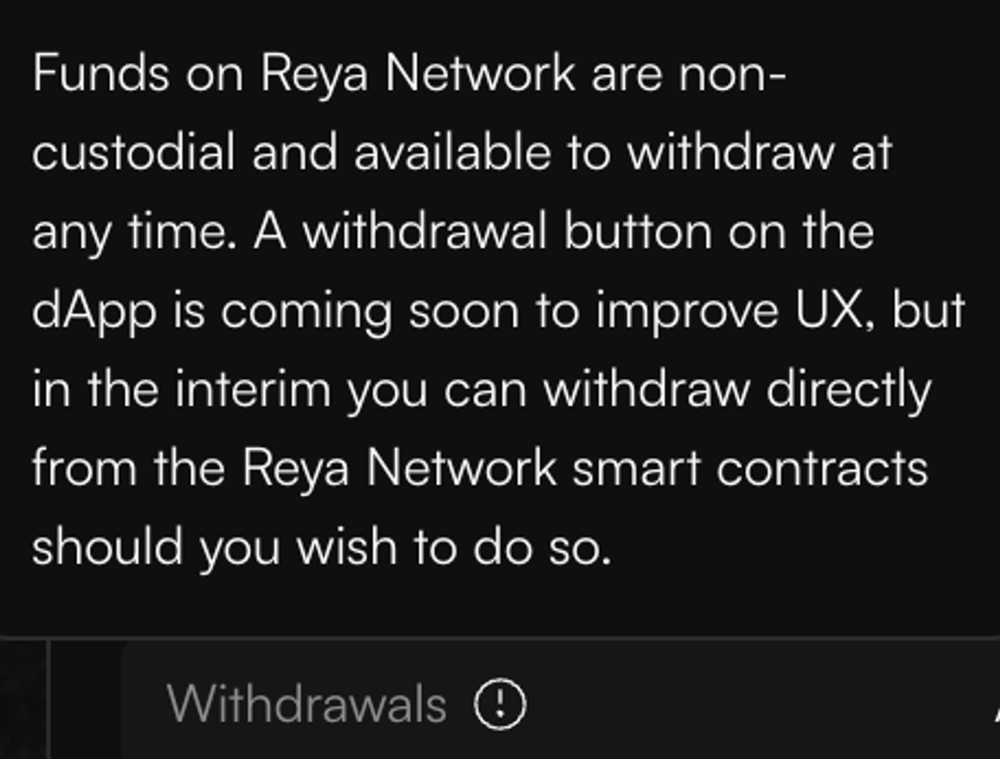

# Smart contract withdrawals

As shown in the dApp funds on Reya Network are non-custodial and available to withdraw at anytime. A withdrawal button on the dApp is coming soon, but in the interim you can withdraw directly from the Reya Network smart contracts.

<figure><figcaption></figcaption></figure>

**Follow the guide below to withdraw from the smart contracts.**

***

1.  Bridge ETH to Reya Network for gas fees and Socket bridge fees by using this bridge: [https://bridge.gelato.network/bridge/reya-network](https://bridge.gelato.network/bridge/reya-network). Note that:

    1. The bridge does not support ETH withdrawals for the time being, so make sure you don’t bridge too much ETH.
    2. Trading on Reya Network is made gas-free via a relayer architecture, if you’re interacting with the contracts directly you will need to pay a small amount of gas (hence the ETH needed).

    <figure><figcaption></figcaption></figure>
2.  Withdraw funds from the Passive Pool into your wallet on Reya Network by calling the removeLiquidity function here: [https://usecannon.com/packages/reya-omnibus/latest/1729-main/interact/reya-omnibus/PoolProxy/0xB4B77d6180cc14472A9a7BDFF01cc2459368D413#selector-0x0b7c92f9](https://usecannon.com/packages/reya-omnibus/latest/1729-main/interact/reya-omnibus/PoolProxy/0xB4B77d6180cc14472A9a7BDFF01cc2459368D413#selector-0x0b7c92f9). To do this, you need to input the following parameters:

    1. poolId: 1
    2. sharesAmount: the amount you want to withdraw multiplied by 10^30 (10 to the power of 30).
    3. minAmount: 0
       1. note that this is essentially a price limit on the share price of the passive pool — min amount is the minimum amount of rUSD received in exchange of the shares amount specified above. If you wish, you can compute this by multiplying the amount withdrawn by the share price (you might want to introduce a buffer as well in case share price changes).

    For example, if you want to withdraw 99.5 rUSD, the parameters will be:

    1. poolId: 1
    2. sharesAmount: 99500000000000000000000000000000
    3. minAmount: 0
3. Unwrap rUSD into USDC by calling the withdraw function here: [https://usecannon.com/packages/reya-omnibus/latest/1729-main/interact/reya-omnibus/RUSDProxy/0xa9F32a851B1800742e47725DA54a09A7Ef2556A3#selector-0x2e1a7d4d](https://usecannon.com/packages/reya-omnibus/latest/1729-main/interact/reya-omnibus/RUSDProxy/0xa9F32a851B1800742e47725DA54a09A7Ef2556A3#selector-0x2e1a7d4d).\
   To do this, you need to input the following parameters:
   1. amount: the amount withdrawn at the previous step, multiplied by 10^6.\
      For example, if you withdrawn 99.5 rUSD, the parameters will be amount = 99500000
4. Confirm you have USDC in your Reya Wallet.
   1. Add the chain to your wallet. There is a link in the footer of: [https://explorer.reya.network/](https://explorer.reya.network/)\
      .png>)
   2. Add the token at address: 0x3B860c0b53f2e8bd5264AA7c3451d41263C933F2\
      For example using Metamask:\
      .png>)\
      Enter the contract address and the symbol and decimals should auto-populate. Press Next\
      .png>)
5.  Once confirmed, you should bridge funds from Reya Network to a source chain (Ethereum Mainnet/Arbitrum/Optimism/Polygon). To do this, you have to call the bridge function on the Socket contract here: [https://explorer.reya.network/address/0x1d43076909Ca139BFaC4EbB7194518bE3638fc76?tab=write\_contract#405e720a](https://explorer.reya.network/address/0x1d43076909Ca139BFaC4EbB7194518bE3638fc76?tab=write\_contract#405e720a).

    \
    To do this, you have to provide the following parameters:

    1. receiver: your wallet address on the source chain (the chain you are withdrawing to)
    2. amount: the amount withdrawn at the previous steps, multiplied by 10^6
       1. note: the pull down at the end of the row will help you multiply by 10^6 but this number should be the same as the one used in the previous steps
    3. msgGasLimit: 10000000
    4.  connector: the socket connector address assigned to the source chain you want to withdraw to.

        | Network          | Connector Address                          |
        | ---------------- | ------------------------------------------ |
        | Ethereum Mainnet | 0x807B2e8724cDf346c87EEFF4E309bbFCb8681eC1 |
        | Arbitrum         | 0x663dc7E91157c58079f55C1BF5ee1BdB6401Ca7a |
        | Optimism         | 0xe48AE3B68f0560d4aaA312E12fD687630C948561 |
        | Polygon          | 0x54CAA0946dA179425e1abB169C020004284d64D3 |
    5. execPayload: 0x
    6. options: 0x
    7. Send native ETH (uint256):the socket bridge fees. As these are dynamic, you can use 15688224757845408 to account for most cases (this is equivalent to 0.015688224757845408 ETH). Note that you can use lower amount as well (e.g. 1000000000000000, which is equivalent to 0.001 ETH), but it might fail if Socket fees increase.

    Upon completion of these steps, funds should be in the destination wallet address entered, on the network corresponding to the network connecter address used, in 10-15min. If you have not received your funds after an hour, please open a support ticket in our Discord and we can try and help.
